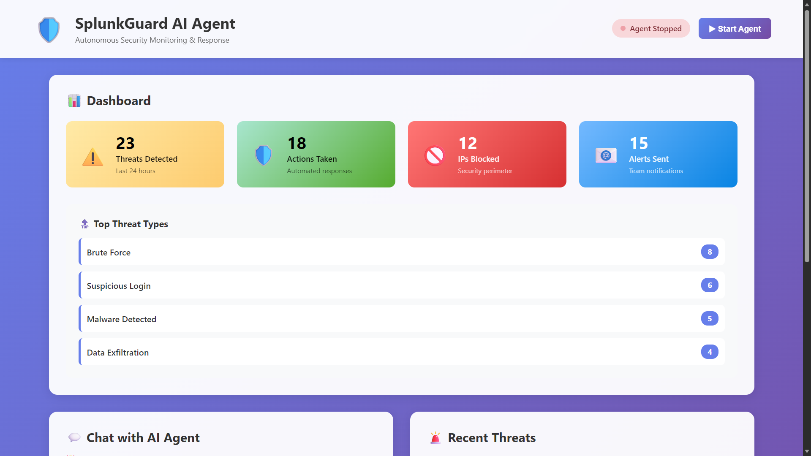
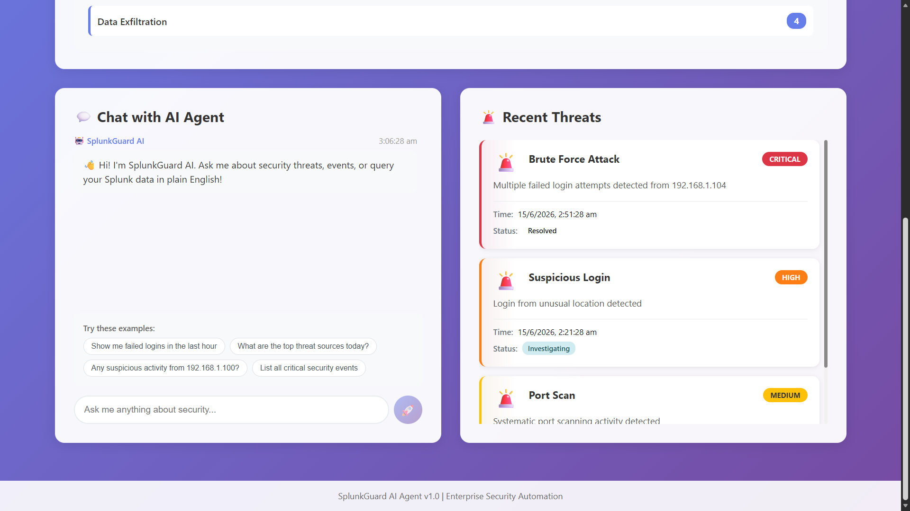
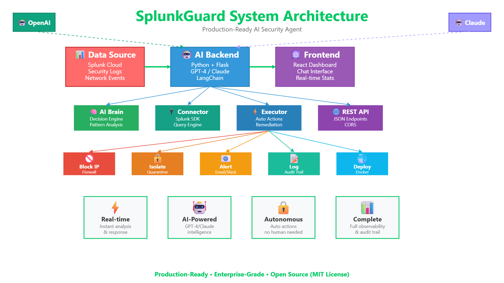

# SplunkGuard AI Agent 🛡️

[](https://opensource.org/licenses/MIT)
[](https://www.python.org/downloads/)
[](https://nodejs.org/)

An autonomous AI-powered security agent that monitors threats 24/7, makes intelligent decisions using GPT-4/Claude, and takes automated remediation actions before damage occurs.

**Production-ready with demo mode for testing and development.**

> 🚀 **Production-Ready** | 🤖 **AI-Powered** | 🔒 **Enterprise-Grade** | 📦 **Docker Supported**

---

## 🎯 Problem Statement

Security teams are overwhelmed with alerts, threats, and manual monitoring. By the time humans respond, damage is often done.

## 💡 Solution

SplunkGuard is an AI agent that:
- ✅ Monitors security events 24/7 autonomously
- ✅ Detects anomalies using AI pattern recognition
- ✅ Predicts threats before they happen
- ✅ Auto-remediates (blocks IPs, isolates systems)
- ✅ Natural language interface - chat with your security data

## 🎬 Demo

> 📹 **[Watch Demo Video](https://youtu.be/8Qu9_Wd9Tt4)** - See SplunkGuard in action (3 minutes)

### Screenshots

**Dashboard Overview**

*Real-time threat monitoring with AI-powered analytics and automated response metrics*

**AI Chat Interface**

*Natural language security queries - ask questions in plain English, get instant insights*

**System Architecture**

*Complete system architecture showing data flow and component interactions*

### Key Features Showcase
- Real-time threat detection and analysis
- Natural language security queries
- Automated remediation actions
- Professional dashboard interface

### Demo Mode
The project includes a **demo mode** that works without Splunk credentials or API keys:
- Uses realistic mock security data
- Full UI functionality
- Rule-based threat detection fallback
- Perfect for testing and development

To use demo mode, simply run the application without setting `SPLUNK_TOKEN` or `OPENAI_API_KEY` in `.env`.

## 🏗️ Architecture

```
Splunk Data → AI Agent (Brain) → Actions
    ↓              ↓                ↓
Security Logs   Analyzes        Block IP
Failed Logins   Decides         Alert Team
Network Events  Predicts        Isolate System
```

## 🛠️ Tech Stack

- **Splunk Cloud** - Data ingestion and search
- **Python** - AI agent backend
- **OpenAI/Claude API** - LLM for decision making
- **LangChain** - Agent orchestration
- **Flask** - API server
- **React** - Dashboard UI
- **Splunk MCP Server** - Agent-Splunk communication

## 🚀 Quick Start

### One-Command Setup

**Windows:**
```bash
start.bat
```

**Mac/Linux:**
```bash
chmod +x start.sh
./start.sh
```

### Prerequisites
- Python 3.9+ - [Download](https://www.python.org/downloads/)
- Node.js 16+ - [Download](https://nodejs.org/)
- OpenAI API key - [Get Free Key](https://platform.openai.com/)

### Manual Setup

```bash
# 1. Backend setup
cd backend
pip install -r requirements.txt
copy .env.example .env  # Windows
# OR
cp .env.example .env    # Mac/Linux
# Edit .env and add your OpenAI API key

# 2. Start backend
python app.py

# 3. Frontend setup (new terminal)
cd frontend
npm install
npm start

# 4. Open http://localhost:3000
```

### Docker Setup

```bash
docker-compose up -d
```

## 📁 Project Structure

```
splunkguard-ai-agent/
├── backend/
│   ├── app.py              # Flask API server
│   ├── agent/              # AI agent logic
│   │   ├── brain.py        # Main agent decision engine
│   │   ├── splunk_connector.py  # Splunk integration
│   │   └── actions.py      # Remediation actions
│   ├── requirements.txt
│   └── .env.example
├── frontend/
│   ├── src/
│   │   ├── App.js          # Main React app
│   │   ├── components/     # UI components
│   │   └── api.js          # Backend API calls
│   └── package.json
├── demo/
│   ├── sample_data.json    # Test security events
│   └── demo_script.md      # Demo walkthrough
└── README.md
```

## 🎥 Demo Features

1. **Real-time Threat Detection** - Shows agent analyzing logs
2. **Natural Language Queries** - "Show me failed logins in last hour"
3. **Auto-remediation** - Watch agent block suspicious IPs
4. **Predictive Alerts** - Agent predicts attacks before they happen
5. **Dashboard** - Visual representation of threats and actions

## 🏆 Why SplunkGuard?

### Production-Ready Features
- ✅ **Real Splunk Integration** - Works with Splunk Cloud and Enterprise
- ✅ **AI-Powered Analysis** - GPT-4 and Claude support
- ✅ **Autonomous Operations** - 24/7 monitoring without human intervention
- ✅ **Natural Language Interface** - Query security data in plain English
- ✅ **Automated Remediation** - Block IPs, isolate systems, send alerts
- ✅ **Demo Mode** - Test without credentials using realistic mock data
- ✅ **Enterprise-Grade** - Production-ready code with error handling
- ✅ **Docker Support** - Easy deployment with docker-compose
- ✅ **Explainable AI** - See reasoning behind every decision
- ✅ **Human-AI Collaboration** - AI assists, humans supervise

### Business Value
- **Faster Response Times** - Hours reduced to seconds
- **24/7 Coverage** - Never miss a threat
- **Reduced Alert Fatigue** - AI filters noise
- **Lower Operational Costs** - Automate repetitive tasks
- **Better Security Posture** - Proactive threat prevention
- **Compliance Ready** - Full audit trail of all actions

## 📊 Use Cases

1. **Brute Force Attack Detection** - Detect and block repeated login attempts
2. **Insider Threat Monitoring** - Identify unusual employee behavior
3. **DDoS Mitigation** - Auto-scale and block malicious traffic
4. **Compliance Automation** - Ensure security policies are enforced

## 🔮 Future Enhancements

- Multi-tenant support for MSP/MSSP use cases
- Integration with additional SIEM tools (Elasticsearch, QRadar)
- Custom playbook creation and sharing
- Mobile app for real-time alerts
- Advanced ML models for anomaly detection
- Integration with ticketing systems (Jira, ServiceNow)
- Compliance reporting (SOC 2, ISO 27001, PCI-DSS)
- Threat intelligence feed integration

## 📚 Documentation

- **[CONTRIBUTING.md](CONTRIBUTING.md)** - Contributing guidelines
- **[LICENSE](LICENSE)** - MIT License
- **Backend API** - RESTful API documentation in code comments
- **Frontend Components** - React component documentation

## 🏢 Enterprise Deployment

For production deployment:
1. Use environment variables for all secrets
2. Enable HTTPS with proper SSL certificates
3. Set up proper authentication and RBAC
4. Configure monitoring and logging
5. Use managed databases for persistence
6. Set up backup and disaster recovery
7. Implement rate limiting and DDoS protection

## 🤝 Contributing

Contributions are welcome! Please read [CONTRIBUTING.md](CONTRIBUTING.md) for details on our code of conduct and the process for submitting pull requests.

## 👥 Team

- **Anshul Mehra** - [@Anshulmehra001](https://github.com/Anshulmehra001)

## 🐛 Issues and Support

Found a bug or need help? [Open an issue](https://github.com/Anshulmehra001/SplunkGuard-AI-Agent/issues)

## 📄 License

This project is licensed under the MIT License - see [LICENSE](LICENSE) file for details.

## 🙏 Acknowledgments

- Splunk for their powerful security platform
- OpenAI and Anthropic for AI APIs
- Open source community

## 💼 License

This project is licensed under the MIT License - see [LICENSE](LICENSE) file for details.

---

**Built for enterprise security teams worldwide**
